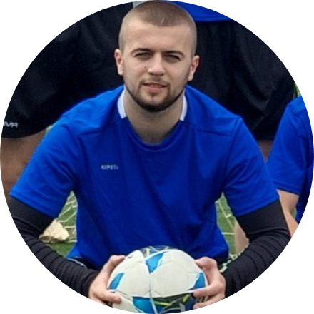

# Обавештења 2024-2025

* Званичан сајт [електријаде](https://www.elektrijada.net/).
* Нема за сад ништа јбг

# Одлазак 2024

* (Не)Званични координатори за науку и спорт: 

&nbsp &nbsp &nbsp &nbsp &nbsp <a href="https://mail.google.com/mail/?view=cm&fs=1&tf=1&to=lazar@uni.kg.ac.rs"> Лазар Илић </a> &nbsp &nbsp &nbsp &nbsp &nbsp &nbsp &nbsp <a href="https://mail.google.com/mail/?view=cm&fs=1&tf=1&to=radosavljevicdanilo333@gmail.com">Данило Радосављевић</a>

### Остварени успеси

 * Освојена бронзана медаља из научне дисциплине аналогна електроника

### Топ моменти

<iframe width="1920" height="798" src="https://www.youtube.com/embed/6bFPemZ9j1c" title="Elektrijada Official Aftermovie 2024" frameborder="0" allow="accelerometer; autoplay; clipboard-write; encrypted-media; gyroscope; picture-in-picture; web-share" referrerpolicy="strict-origin-when-cross-origin" allowfullscreen></iframe>

**Ћирко**

